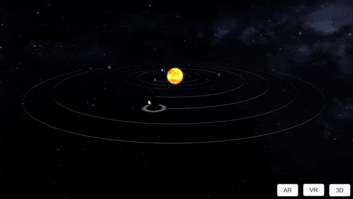
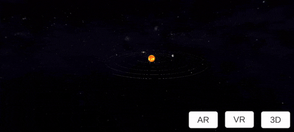

# unity-solar-system-xr

This project shows how to get 3D, AR and VR running with the same source base, and switch between modes at runtime.

*Disclaimer: Planets sizes, orbits and distances are not to scale !*

## Desktop

### 3D

Navigation :

 - Mouse pointer : Camera orientation with left button clicked
 - Mouse wheel : Zoom in and out
 - Keyboard arrows : Forward & backward, left & right   

## Mobile 

Mobile platforms supports all modes : 

### 3D

Navigation :

 - Multi-touch pinch : Zoom in and out
 - Single touch : Forward & backward, left & right 

### VR

Navigation :

 - Multi-touch pinch : Zoom in and out
 - Gyroscope : Camera orientation, forward & backward, left & right

Currently not very stable, the camera orientation should be improved

### AR 

Navigation : 

 - Gyroscope : Camera orientation, forward & backward, left & right
 
## Oculus Quest

### VR

Navigation : 

 - Use headset sensor for camera orientation
 
Plan to move to new input system and handle controllers

## Credits

* Solar System Scope textures pack : https://www.solarsystemscope.com/textures/

